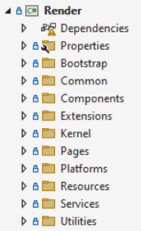

# Developer documentation

This section includes a comprehensive collection of materials that details the process, methodologies and standards used in the Render project.

## Introduction

**Render** is a cross-platform application for both desktop and mobile, designed to record, play, and modify audio. Built using Microsoft\'s development solutions, Render relies on the Couchbase NoSQL database at its core. This database can store data locally and synchronize it over local or global networks, eliminating the need for a web API.

### Core technology stack

The Render application utilizes Microsoft [.NET 8
SDK](https://dotnet.microsoft.com/en-us/download/dotnet/8.0).

Desktop version of the application is based on the latest Microsoft UI
framework [Win UI
3](https://learn.microsoft.com/en-us/windows/apps/winui/winui3/)
alongside with the newest Windows developer components and tools such as
[Windows App
SDK](https://learn.microsoft.com/en-us/windows/apps/windows-app-sdk/):

All these underlying tools are wrapped by [Microsoft .NET Multi-platform
App UI](https://dotnet.microsoft.com/en-us/apps/maui) framework.

On the top of MAUI framework application is built using [Reactive
UI](https://www.reactiveui.net/) framework.

For storing data locally and syncing them, the application relies on the
[Couchbase Mobile](https://www.couchbase.com/products/mobile/) database.

    

### Utilities

The Render application uses many specific tools and libraries for UI
customization, audio conversion, logging and analytics.

Audio decoding and encoding is based on
[Concentus](https://github.com/lostromb/concentus) library.

For displaying popup pages and for some specific UI components the
application utilizes [MAUI Community
Toolkit](https://learn.microsoft.com/en-us/dotnet/communitytoolkit/maui/)

Custom UI components such as wave forms are developed using
[SkiaSharp](https://github.com/mono/SkiaSharp)

For tracking crashes and analytics in the application [Microsoft App
Center](https://appcenter.ms/) platform is used.

Logging functionality is implemented utilizing
[NLog](https://nlog-project.org/) library.

Unit tests are written using [xUnit](https://xunit.net/) testing
framework.

   

## Getting started

### System requirements

To build, launch and debug the Render application Windows based machine
is required with the latest development environment such as [Microsoft
Visual Studio 2022](https://visualstudio.microsoft.com/) or [Jet Brains
Rider](https://www.jetbrains.com/rider/).

To use Microsoft Visual Studio as development environment the following
components must be selected during installation:

1.  .NET Multi-platform App UI development:\
    

2.  Windows application development:\
    

To use Jet Brains Rider as a development environment all dependencies
must be installed manually using [command
line](https://github.com/dotnet/docs-maui/blob/main/docs/get-started/installation.md#install-net-and-net-maui-workloads)
or [Visual Studio Build
Tools](https://visualstudio.microsoft.com/downloads/?q=build+tools).

The Render application supports both Windows 10 and Windows 11operation
systems, but minimum Windows version must be **10.0.17763.0**. Target
application version is **10.0.19041.0.**

### Setting up the development environment

Before building and launching application the following actions must be
done:

1.  Enable [developer
    mode](https://learn.microsoft.com/en-us/windows/apps/get-started/enable-your-device-for-development?OCID=WinClient_Ver1703_Settings_DevMode)
    for Windows machine:\
    

2.  Add appropriate configuration values in *AppSettings.json* file in
    the root project directory:\
    **ReplicationUri** -- URI for the remote database for web
    replication\
    **PeerUserName, PeerPassword** -- username and password for web
    replication\
    **ApiEndpoint** -- API endpoint for the application user
    authentication.

### Launch Render demo

To see how the Render application looks like and to try basic
functionality, it is possible to launch the application in demo mode. In
this mode the application can work with local database only and data
synchronization is disabled.

To launch application in demo mode the following actions must be done:

1.  Switch build configuration to **Demo**.

2.  Check **Couchbase Lite** license: if enterprise license is not
    available, remove **Couchbase.Lite.Enterprise** NuGet package and
    install free-to-use **Couchbase.Lite** package instead.

    1.  Due to restricted features in Couchbase.Lite package it is
        mandatory to remove **Couchbase.Lite.P2P** dependency in
        *Render.Services\\SyncService\\LocalReplicator.cs* file

    2.  Remove all implementation details in *LocalReplicator* class:\
        

    3.  Remove implementation details from *BucketReplication* class,
        *StartReplication* method:\
        

3.  Select *net8-windows* as taget framework:  
    

4.  Build and launch the application for the first time. After
    successful launch, close the application. 

5.  Copy and replace demo project local database from the *demo_database* directory to the
    *C:\\Users\\UserName\\AppData\\Local\\Packages\\BAA1E222-D1B3-4A73-ADB4-3500D19C1B37_k7n2kdbkeecg2\\LocalState\\*
    directory.

6.  Launch the Render application again.

7.  Select **Render Demo User** account or type "**renderdemo**" as username and use "**renderdemo**" as password string.

8.  Log in into the application and try it out!

It worth mentioning, that if database is missed or copied incorrectly
the connection error popup occurred during the login process.\

## Developer guide

### Solution structure

Render solution is structured by three directories.

Key directories description:

1.  App - a directory with main Render projects such as Render (startup
    project) and Render.Sequencer (key application component project).

2.  Domain - a directory with auxiliary projects for database access,
    services, mocks etc.

3.  Tests - a directory for project with unit tests

### Projects structure

#### Render

Main application project with UI components, core business logic and
platform specific implementations

Key directories description:

1.  Bootstrap - a directory for booting up the application, register
    shared dependencies, resources and boot 3^rd^ party libraries

2.  Components - a directory for shared XAML UI components

3.  Kernel - a key directory with base classes and interfaces for view
    models, navigation, gesture detecting etc.

4.  Pages - a directory for all application pages, divided by specific
    features such as AppStart, Settings, Configurator etc.

5.  Platforms - a directory that contains platform-specific features,
    such as dependency registration, manifest files, platform-specific
    implementations of shared components

6.  Resources - a directory with all application resources such as
    fonts, icons, images, localized strings and XAML styles.

#### Render.Sequencer

Key application project for Sequencer component. The Sequencer is a UI
component for playing, recording and modifying audio using a visual
representation of it in the form of waveforms.

Key directories description:

1.  Core - a directory for core Sequencer features such as playing,
    recording, modifying audio, drawing waveforms etc.

2.  Platforms - a directory with platform specific implementations of
    UI components

3.  Views - a directory with key Sequencer views such as wave form,
    scroller, scrubber, tool bar etc.

#### Render.Interfaces

A project with interfaces for platform specific implementations mostly:

#### Render.Mocks

A project with mock implementations of audio features and platform
permissions. Used by automation testing tools.

#### Render.Models

A project with all application domain models.

Key directories description:

1.  Audio - a directory for wrapping audio data

2.  FakeModels - a directory with fake models for unit testing

3.  Project, Scope, Sections, Snapshot, Users, Workflow -- directories
    that represent the entire core domain of the application. See [Key Terms](#key-terms) section for description.

#### Render.Repositories

A project that implements data manipulation using a local database.

#### Render.Services

A project with all infrastructure services

Key directories description:

1.  AudioPlugins, AudioServices -- a directory for audio services such
    as audio conversion, audio playback, audio recording, breath pause
    analyzer, etc.

2.  EntityChangeListenerServices -- a directory with services for
    listening to changes in domain models at the database level.

3.  SessionStateServices -- a directory with services to listen to
    current application session state (current user, project, scope,
    audio etc.)

4.  SyncService -- a directory with all services related to data sync.
    Contains implementations for web and local replicators, audio
    integrity service, hand share service, etc.

5.  WaveformService -- a directory with services for conversion audio
    data into its visual representation in the form of waveform

#### Render.TempForVessel

Obsolete project with deprecated domain models that are partially in
use. Must be merged with Render.Models project:

#### Render.WebAuthentication

Project for user authentication to login into the application and use
web and local sync.

#### Render.UnitTests

Unit testing project

Key directories description:

1.  App - a directory for main application test (pages, page models
    etc.)

2.  Domain - a directory for testing core application functionality
    (audio conversion, session state etc.)

3.  TestData - a directory with test audio data

### Design concepts

#### Architecture

The Render project is a cross-platform application designed with a
robust and scalable architecture using the [MVVM (Model-View-View Model)
pattern](https://learn.microsoft.com/en-us/dotnet/architecture/maui/mvvm).
MVVM architecture pattern of the application is based on key [Reactive
UI](https://www.reactiveui.net/) framework concepts and components.

ReactiveObject is the base object for all application [PageModels and
ViewModels](https://www.reactiveui.net/docs/handbook/view-models/index.html)
classes, and it implements INotifyPropertyChanged. In addition,
ReactiveObject provides Changing and Changed Observables to monitor
object changes.

To avoid boilerplate code for observable properties,
[ReactiveUI.Fody](https://www.nuget.org/packages/ReactiveUI.Fody/)
library is employed in the Render project for injecting
INotifyPropertyChanged code into properties at compile time.

By project history, bindings between ViewModel and View are defined in
code-behind .cs file. XAML bindings are avoided. It worth to mention
[recommendations about dispose
pattern](https://www.reactiveui.net/docs/handbook/when-activated) in
terms of reactive bindings and subscriptions.

The domain layer is designed using the [Domain-Driven Design
(DDD)](https://learn.microsoft.com/en-us/archive/msdn-magazine/2009/february/best-practice-an-introduction-to-domain-driven-design)
pattern. See details below.

#### Navigation

The Render application uses a standard single stack navigation pattern,
meaning it maintains a single stack of pages for navigation. Navigation
approach is based on Reactive UI framework routing. Routing enables an
application to coordinate navigation through multiple views and their
corresponding view models, and to keep track of the user\'s navigation
state. This straightforward approach avoids the complexity of managing
multiple navigation stacks, simplifying the user experience and the
navigation flow. Key navigation methods are implemented in
*Render/Kernel/ViewModelBase.cs* class and can be called by any derived
page or view model.

#### Service location

Service location is managed through the combination of the
*Render/Kernel/ViewModelContextProvider.cs* class and the *Splat*
container. Services and ViewModels are registered with the container,
and dependencies are resolved and injected automatically when required.
Page to PageModel and View to ViewModel references registered
automatically during application start up process, using assembly
scanning mechanism by the Reactive UI framework.

#### Data management

Data management in the Render application is designed to be robust and
efficient, ensuring seamless data storage, retrieval, and
synchronization. The application uses Couchbase as the primary NoSQL
database, leveraging its features for local data storage and
synchronization. Direct synchronization is achieved through Couchbase\'s
replication mechanism, providing real-time data consistency across
devices and backend systems.

Data in the local storage saved in three buckets: "*localonlydata*",
"*render*" and "*renderaudio*". 

**"Localonlydata"** bucket contains data
about logged users, session information, translations, transcriptions,
local projects data, and its state, etc.\
**"Render"** bucket contains data downloaded from remote database such
as information about all the work which can be done in scope of the
projects.\
**"Renderaudio"** bucket contains all the audio data, including local
user translations and audio data from remote database.

For managing CRUD operations with Couchbase database in the application
implemented *CouchbaseLocal.cs* wrapper class in
[Render.Repositories](#renderrepositories) project.

The application utilizes the Repository pattern to encapsulate data
access logic and provide a clean API for data retrieval and
manipulation. The Repository pattern abstracts the underlying data
sources, enabling the view-layer entities to interact with a consistent
interface without needing to know the specifics of data storage or
synchronization. See implementation in
[Render.Repositories](#render.repositories) project (e.g.
*LocalDataRepositories, SectionRepository, WorkflowRepositories* etc.)

#### Data synchronization

The Render application does not utilize a traditional web API for data
synchronization. Instead, it uses an internal Couchbase replication
mechanism. In the Render application, three types of synchronization can
be established: **web sync**, **peer-to-peer sync**, and **sync from a
local or portable drive**.

**Web-sync** has the highest priority and can be established if an
internet connection is available. This type of sync is used for data
synchronization between a specific device and remote Couchbase database
server. See implementation details in the following files:
*Render.Services\\SyncService\\SyncService.cs*,\
*Render.Services\\SyncService\\ReplicatorWrapper.cs*

**Peer-to peer sync** can be established when at least two devices are
connected to the same local network. This type of sync is used for data
synchronization between local devices only. See implementation details
in the following files:\
*Render.Services\\SyncService\\LocalSyncService.cs*,\
*Render.Services\\SyncService\\LocalReplicator.cs*

**Sync from local or portable drive.** This type of sync is used for
importing data from local storage or portable USB-drive. The user can
select a specific directory to replicate data into the Render
application. See implementation details in the following file:
*Render.Services\\SyncService\\DbFolder\\DbLocalReplicator.cs*

Detailed information and description about application's sync mechanism
implementation see [Sync documentation]{.underline}.

### Key components and flow

The core flow of the application is to facilitate Bible translation.
This is achieved by moving each piece of Bible audio data (Section)
through specific phases (Stages and Substages i.e. Steps) to create,
review, and revise oral translations and text transcriptions. At the
result point, all translations must be approved by a consultant and
might be exported in the ordered bunch of audio files. Based on this,
the following key components are identified for the application:

-   **App Startup**

-   **Download and Select Project**

-   **Configure Project**

-   **Work with Project (Workflow)**

-   **Approve**

-   **Sync**

-   **Check Status**

-   **Export Audio**

See the general application flow in the screenshot below:

#### Domain model

The Render application has a complex domain model to support all
required business scenarios. For these purposes Domain-Driven Design
(i.e. DDD) as a software development approach was chosen. DDD helps
create more maintainable, flexible, and scalable projects. This approach
ensures that the software evolves in tandem with changes in the
business.

The core of the domain layer in the Render application is Project.
Project domain entity represents abstraction about the entire work that
must be done. Key piece of project is Section. Section is a domain model
that represents a piece of data that must be translated in audio or text
form. Section is moved through the stages and substages (i.e. steps) to
achieve a result.

For implementation details about domain models and their relationships
refer to the [Render.Models](#rendertempforvessel) and [Render.TempForVessel](#rendertempforvessel) projects.

Class hierarchy for key domain entities is presented in the diagram
below:

Class hierarchy for audio domain entities is presented in the diagram
below:

Class hierarchy for value objects is represented in the diagram below:

*Notes:\
**Domain Entity** is a base object that has a distinct
identity that runs through time and different states. In the Render
project domain, the entity contains all necessary information to support
Couchbase database operations with data. (e.g. Scope, Section, Project
etc.)*\
***Value object*** is an immutable type that is defined by its
attributes rather than a unique identity (e.g. TimeMarkers,
ScriptureReference etc.)*

Key domain entities diagram with their relationships and short
description is presented on the diagram below.

Draft related entities diagram with their relationships and short
description is presented on the diagram below.

Conversation related entities diagram with their relationships and short
description is presented on the diagram below.

*Note:\
It is worth mentioning that **Conversations** (belong to
Drafts) and **Flags** (belong to CommunityTest) have the same
meaning. Both entities represent critical points on the audio that must
be clarified for some reason (but they have different visual forms).
This happened historically due to technical reasons.*

#### Application startup

The application startup is the initial component (see
*Render/Pages/AppStart* directory for details) where users can go the
authentication process and download the list of projects available for
their account during the replication process. For further details, refer
to *Render/Pages/AppStart/Login/LoginViewModel.cs* and
*Render/Pages/AppStart/Login/AddVesselUserViewModel.cs*.

For the user authentication the Render application calls FCBH (Faith
Comes by Hearing) related API endpoint to check user credentials. See
FCBH documentation for details. After successful
authentication the user can synchronize the available project list and
proceed to the main application flow.

There are two user account types: Local Render User (or simply Render
user, see *Render.Models/Users/RenderUser.cs* for details) and Global
Render User, hereinafter **Configure** (see
*Render.Models/Users/User.cs* for details).

A **Configure** is an administrator account. This account type is created on
the Launchpad web application and can be assigned to specific projects
(Launchpad is the application project and user management. Refer to the
Launchpad documentation for more information). Configure users have full
permission for configuring and setting up projects and managing local
users.

A Render User is a local account and is not represented on the Launchpad
web application. Render users do not have administrative permissions to
configure and set up projects. A Render user must be assigned to
specific work by Global user. A Render user account is created in scope
and associated with a specific project.

After authentication, the user will see the list of available projects.
It is mandatory to download and select at least one project to proceed.
Implementation details can be found in the
*Render/Pages/AppStart/ProjectDownload*,\
*Render/Pages/AppStart/ProjectSelect*,\
*Render/Pages/AppStart/ProjectList* directories.

There is an option to add a project using a specific project ID from the
Launchpad web application or import project from local\\portable
storage. For more information, see\
*Render/Pages/AppStart/Login/AddProjectViaIdViewModel.cs*,\
*Render/Pages/AppStart/Login/AddProjectViaIdLocalViewModel.cs*,
*Render/Pages/AppStart/Login/AddProjectViaIdWebViewModel.cs* and
*Render/Components/AddViaFolder/AddFromComputerViewModel.cs.*

#### Configure project

After successful authentication and downloading the project, the
Configure must set up the project for local work (see the
*Render/Pages/Configurator* directory for implementation details). The
configuration process includes the following steps: **Workflow
management, User management, Workflow assignment,** and **Section
assignment**.

**Workflow management** (*Configure Workflow* on the screenshot) is the
process for adding and configuring stages and substages (i.e. steps) to
the current project. See
*Render\\Pages\\Configurator\\WorkflowManagement* directory for
implementation details.

**User management** (*Manage Users* on the screenshot) is the process
for creating and configuring Render (local) users, that belong to a
current project. See *Render\\Pages\\Configurator\\UserManagement*
directory for implementation details.

**Workflow assignment** (*Assign Roles* on the screenshot) is the
process for creating teams for stages and assigning users to them. See
*Render\\Pages\\Configurator\\WorkflowAssignment* directory for
implementation details.

**Section assignment** (*Assign Sections* on the screenshot) is the
process for assigning specific sections (actual work that must be
translated) to the previously created teams. After assigning, the
section must go through the whole list of stages and substages (i.e.
steps) that were configured during the workflow management process. The
section assigned by priority. The Section with higher priority must be
done first. See *Render\\Pages\\Configurator\\SectionAssignment*
directory for implementation details.

#### Workflow

After successful project configuration Render user may login in and
start work with assigned section across the stages. It is worth
mentioning that there are two mandatory stages for each project:
**Draft** stage and **Consultant approval** stages. In the Render
application there are many available stages such as **Draft, Community
Test, Consultant Check, Consultant training, Consultant approval etc.**
Each stage may have one or more substage (i.e. steps). See advanced
stages and substages description in the [Stages description]{.underline}
section.

Main stages and substages (i.e. steps) implementation details
references:

-   **Draft stage:** *Render\\Pages\\Translator*

-   **Peer Check stage, Peer revise step:** *Render\\Pages\\PeerReview*

-   **Community Test stage:** *Render\\Pages\\CommunityTester*

-   **Consultant Check stage:**
    *Render\\Pages\\Consultant\\ConsultantCheck*

-   **Consultant Approval stage:**
    *Render\\Pages\\Consultant\\ConsultantApproval*

-   **Back Translate step:** *Render\\Pages\\BackTranslator*

-   **Transcribe step:** *Render\\Pages\\Transcribe*

-   **Note interpretation step:** *Render\\Pages\\Interpreter*

As a general guideline, sections progress through the stages
sequentially. A section cannot advance to the next stage until the
current stage is fully completed. However, sections can be returned to a
previous stage for revisions following a consultant review or community
testing and may also be reset by the administrator (e.g. Global user).

During the workflow, it is possible to divide source and recorded audio
for more verbatim translations. It is also possible to combine multiple
audio segments into one. See
*Render.Sequencer/ViewModels/SequencerCombiningPlayerViewModel.cs,
Render.Sequencer/ViewModels/ SequencerEditorViewModel.cs* and\
*Render/Components/DivisionPlayer/DivisionPlayerViewModel.cs* for
implementation details.

Upon completion of the stages, a permanent snapshot of the current work
is created. Temporary snapshots can also be created for specific steps.
Permanent snapshots are used to revert sections after resetting by the
administrator or when selecting a revision during specific steps.

The progression of sections through the stages is a complex process.
From a technical perspective, the *GrandCentralStation* class is
responsible for managing section progression. It encompasses the entire
advanced business logic to handle section movement across stages,
section status, and snapshots.

#### Sequencer

The Sequencer is a key application component utilized throughout the
entire application during the progression of stages. The Sequencer
control enables the playback, recording, editing, and combining of
audios. It is designed as a self-contained, composable, and replaceable
control with no domain dependencies, offering a transparent contract for
its clients.

Sequencer key views relationships diagram is presented below:

The Sequencer has a complex view hierarchy that includes the following
key controls:

-   **WaveFormView**: Manages the main waveform items.

-   **WaveFormItemView**: Draws the waveforms and flags.

-   **FlagView**: Draws specific flags that represent critical points in
    the audio.

-   **Scroller**: Draws a mini waveform and scrolls the main waveform.

-   **Toolbar**: Draws toolbar buttons and audio position/length labels.

-   **ToolbarItems**: Contains items for operating the Sequencer.

Sequencer key view models relationships diagram is presented below: 

The key view models and their responsibilities are described below:

-   **SequencerViewModel**: The top-level view model that unifies all
    components into a transparent contract for client use.

-   **InternalSequencer**: The central internal class that manages
    dependencies between each component.

-   **InternalRecorder**: The class responsible for recording
    functionality.

-   **InternalPlayer**: The class responsible for playback
    functionality.

-   **WaveFormViewModel**: The view model responsible for managing
    waveform items.

-   **ScrollerViewModel**: The view model responsible for managing mini
    waveform items and scrolling functionality.

-   **ToolbarViewModel**: The view model responsible for operating the
    sequencer and managing key information about the audio state.

See technical details of the implementation in the [Render.Sequencer](#rendersequencer)
project.

#### Synchronization

Synchronization (i.e. Sync) is a key mechanism of the Render application
that allows data to be consistent across multiple devices and remote
data storage. Sync is based on a key feature of the Couchbase database
that is called
[Replication](https://www.couchbase.com/blog/couchbase-replication-and-sync/).
Replications are sent using Web sockets over a single TCP connection.
Hence, it is a faster protocol, reducing bandwidth use and socket
resources compared to REST-based protocols over HTTP.

Sync can be executed by the following reasons:

1.  User is logging in

2.  It\'s time for automatic synchronization (every \~5 minutes)

3.  User has pressed Sync button from menu flyout

Sync can be started on any page of the application if the user is
successfully logged in and the project is configured. It is worth noting
that web synchronization between the device and the remote database has
higher priority than synchronization between devices on the same local
network. This means that data will be synchronized only between the
device and the remote database, and not between devices on the same
local network. As a result, local connections between devices will not
be established in this scenario.

There are a few retry policies to handle synchronization errors. If any
error occurs the Render application retries to proceed replication
process five times, with the following intervals in seconds: 1, 30, 60,
90 and 150.

See technical details in the *Render.Services\\SyncService* directory.
See advanced information about the synchronization process in the Sync
documentation.

#### Status

The section status can be monitored by users during the workflow by
pressing the \"Section Status\" button in the title bar flyout menu.

This feature allows the management of the section state:

Except section state management it enables resetting the section to a
specific stage as well. This functionality is not available for Render
users (i.e. local users).

For implementation details, refer to the
*Render\\Pages\\Settings\\SectionStatus* directory.

#### Export

The administrator (Global User) can export audio after the completion of
any stage. This functionality is useful for monitoring audio at specific
points in the workflow and to get the result. The audio is exported in
[OPUS](https://opus-codec.org/) format within a
[OGG](https://www.xiph.org/ogg/) container. For implementation details,
refer to the *Render\\Pages\\Settings\\AudioExport* directory.

